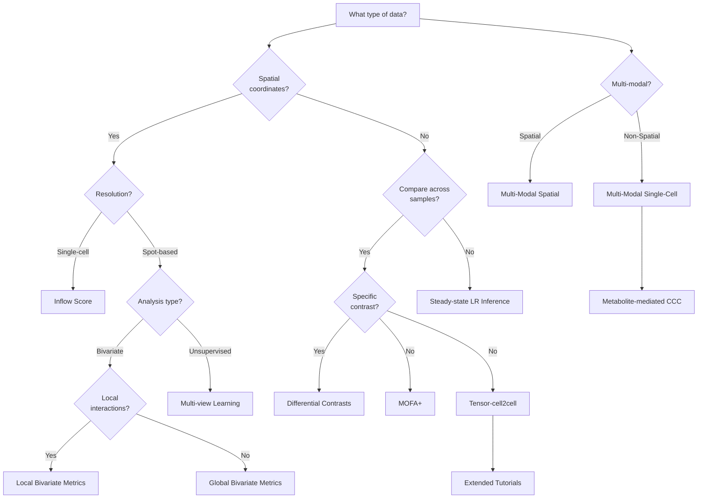

# LIANA+: an all-in-one cell-cell communication framework 

<!-- badges: start -->
[](https://github.com/saezlab/liana-py/actions)
[](https://github.com/saezlab/liana-py/issues/)
[](https://liana-py.readthedocs.io/en/latest/?badge=latest)
[](https://codecov.io/gh/saezlab/liana-py)
[](https://pepy.tech/project/liana)
<!-- badges: end -->

LIANA+ is a scalable framework that adapts and extends existing methods and knowledge to study cell-cell communication in single-cell, spatially-resolved, and multi-modal omics data. It is part of the [scverse ecosystem](https://github.com/scverse), and relies on [AnnData](https://github.com/scverse/anndata) & [MuData](https://github.com/scverse/mudata) objects as input.


## Contributions

We welcome suggestions, ideas, and contributions! Please do not hesitate to contact us, open issues, and check the [contributions guide](https://liana-py.readthedocs.io/en/latest/contributing.html).

## Vignettes
A set of extensive vignettes can be found in the [LIANA+ documentation](https://liana-py.readthedocs.io/en/latest/).

## Decision Tree



## API
For further information please check LIANA's [API documentation](https://liana-py.readthedocs.io/en/latest/api.html).

## Cite LIANA+:

```
@article {Dimitrov2024,
    author = {Dimitrov, Daniel and Sch{\"a}fer, Philipp Sven Lars and  Farr, Elias and Rodriguez-Mier, Pablo and Lobentanzer, Sebastian and Badia-i-Mompel, Pau and Dugourd, Aurelien and Tanevski, Jovan and Ramirez Flores, Ricardo Omar and Saez-Rodriguez, Julio},
    title = {LIANA+ provides an all-in-one framework for cell--cell communication inference},
    journal = {Nature Cell Biology},
    year = {2024},
    volume = {26},
    number = {9},
    pages = {1613--1622},
    DOI = {10.1038/s41556-024-01469-w},
    URL = {https://doi.org/10.1038/s41556-024-01469-w}
}
```

```
@article {Dimitrov2022,
    author = {Dimitrov, Daniel and T{\"u}rei, D{\'e}nes and Garrido-Rodriguez, Martin and Burmedi, Paul L. and Nagai, James S. and Boys, Charlotte and Ramirez Flores, Ricardo O. and Kim, Hyojin and Szalai, Bence and Costa, Ivan G. and Valdeolivas, Alberto and Dugourd, Aur{\'e}lien and Saez-Rodriguez, Julio},
    title = {Comparison of methods and resources for cell-cell communication inference from single-cell RNA-Seq data},
    journal = {Nature Communications},
    year = {2022},
    volume = {13},
    number = {1},
    pages = {3224},
    DOI = {10.1038/s41467-022-30755-0},
    URL = {https://doi.org/10.1038/s41467-022-30755-0}
}
```

Please also consider citing any of the methods and/or resources that were particularly relevant for your research!

[uv]: https://github.com/astral-sh/uv
[scverse discourse]: https://discourse.scverse.org/
[issue tracker]: https://github.com/saezlab/liana-py/issues
[tests]: https://github.com/dbdimitrov/liana-py/actions/workflows/test.yaml
[documentation]: https://liana-py.readthedocs.io
[changelog]: https://liana-py.readthedocs.io/en/latest/release_notes.html
[api documentation]: https://liana-py.readthedocs.io/en/latest/api.html
[pypi]: https://pypi.org/project/liana
